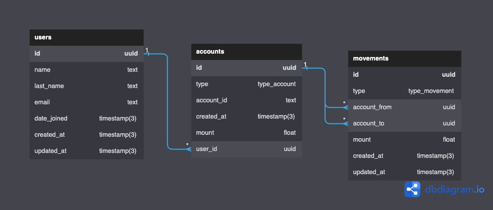

<p align="center" style="background-color:white">
 <a href="https://www.ravn.co/" rel="noopener">
 </a>
</p>
<p align="center">
 <a href="https://www.postgresql.org/" rel="noopener">
 </a>
</p>

---

<p align="center">A project to show off your skills on databases & SQL using a real database</p>

## 📝 Table of Contents

- [Case](#case)
- [Installation](#installation)
- [Data Recovery](#data_recovery)
- [Excersises](#excersises)

## 🤓 Case <a name = "case"></a>

As a developer and expert on SQL, you were contacted by a company that needs your help to manage their database which runs on PostgreSQL. The database provided contains four entities: Employee, Office, Countries and States. The company has different headquarters in various places around the world, in turn, each headquarters has a group of employees of which it is hierarchically organized and each employee may have a supervisor. You are also provided with the following Entity Relationship Diagram (ERD)

#### ERD - Diagram <br>

 <br>

---

## 🛠️ Docker Installation <a name = "installation"></a>

1. Install [docker](https://docs.docker.com/engine/install/)

---

## 📚 Recover the data to your machine <a name = "data_recovery"></a>

Open your terminal and run the follows commands:

1. This will create a container for postgresql:

```
docker run --name nerdery-container -e POSTGRES_PASSWORD=password123 -p 5432:5432 -d --rm postgres:15.2
```

2. Now, we access the container:

```
docker exec -it -u postgres nerdery-container psql
```

3. Create the database:

```
create database nerdery_challenge;
```

5. Close the database connection:
```
\q
```

4. Restore de postgres backup file

```
cat /.../dump.sql | docker exec -i nerdery-container psql -U postgres -d nerdery_challenge
```

- Note: The `...` mean the location where the src folder is located on your computer
- Your data is now on your database to use for the challenge

---

## 📊 Excersises <a name = "excersises"></a>

Now it's your turn to write SQL queries to achieve the following results (You need to write the query in the section `Your query here` on each question):

1. Total money of all the accounts group by types.

```
select a.type, sum(a.mount) from accounts a group by a.type;
```


2. How many users with at least 2 `CURRENT_ACCOUNT`.

```
select count(*) from (select count(*) from accounts a 
where a."type" = 'CURRENT_ACCOUNT'
group by a.user_id
having count(a.user_id) >= 2);
```


3. List the top five accounts with more money.

```
select u.id, sum(a.mount) from users u 
inner join accounts a on u.id = a.user_id
group by u.id 
order by sum(a.mount) desc limit 3; 
```


4. Get the three users with the most money after making movements.

```
create or replace function credit_mount(i uuid, m float8)
returns float8
language plpgsql
as
$$
declare
balance float8;
begin 
update accounts
set mount = mount + m
where id = i;

select mount into balance from accounts where id = i;

return balance;

end;
$$;

create or replace function debit_mount(i uuid, m float8) 
returns float8
language plpgsql
as
$$
declare
current_balance float8;
begin
select mount into current_balance from accounts where id = i;

if current_balance >= m then
update accounts 
set mount = mount - m
where id = i;
return current_balance - m;

else
return -1;
end if;
end;
$$;

do
$$
declare r record;
begin
for r in select * from movements m where "type" = 'IN'
loop
perform credit_mount(r.account_from, r.mount);
end loop;
end;
$$;

do
$$
declare r record;
declare b float8;
begin
for r in select * from movements m where "type" = 'OUT' or "type" = 'OTHER'
loop
b := debit_mount(r.account_from, r.mount);
if b > 0 then
continue;
else
perform credit_mount(r.account_from, r.mount);
end if;
end loop;
end;
$$;

do
$$
declare r record;
declare b float8;
begin
for r in select * from movements m where "type" = 'TRANSFER'
loop
b := debit_mount(r.account_from, r.mount);
if b > 0 then
perform credit_mount(r.account_to, r.mount);
continue;
else
perform credit_mount(r.account_from, r.mount);
end if;
end loop;
end;
$$;

select u.id, sum(a.mount) from users u 
inner join accounts a on u.id = a.user_id
group by u.id 
order by sum(a.mount) desc limit 3;
```


5. In this part you need to create a transaction with the following steps:

    a. First, get the ammount for the account `3b79e403-c788-495a-a8ca-86ad7643afaf` and `fd244313-36e5-4a17-a27c-f8265bc46590` after all their movements.
    b. Add a new movement with the information:
        from: `3b79e403-c788-495a-a8ca-86ad7643afaf` make a transfer to `fd244313-36e5-4a17-a27c-f8265bc46590`
        mount: 50.75

    c. Add a new movement with the information:
        from: `3b79e403-c788-495a-a8ca-86ad7643afaf` 
        type: OUT
        mount: 731823.56

        insert into movements (id, "type", account_from, account_to, mount, created_at, updated_at)
        values (gen_random_uuid(), 'TRANSFER', '3b79e403-c788-495a-a8ca-86ad7643afaf', 'fd244313-36e5-4a17-a27c-f8265bc46590', 50.75, now(), now());
        do
        $$
        declare r record;
        declare b float8;
        begin
        for r in select * from movements m where id = '068ef2b5-a3c4-4d68-b598-702a6b0fa99f'
        loop
        b := debit_mount(r.account_from, r.mount);
        if b > 0 then
        perform credit_mount(r.account_to, r.mount);
        continue;
        else
        perform credit_mount(r.account_from, r.mount);
        end if;
        end loop;
        end;
        $$;
        
        do
        $$
        declare b float8;
        declare m float8 = 731823.56;
        declare idacc uuid = '3b79e403-c788-495a-a8ca-86ad7643afaf';
        begin
        select mount into b from accounts where id = idacc;
        insert into movements (id, "type", account_from, account_to, mount, created_at, updated_at)
        values (gen_random_uuid(), 'OUT', idacc, null, m, now(), now());
        if m > b then
        RAISE NOTICE 'Not enough funds';
        rollback;
        else
        commit;
        end if;
        end;
        $$;
    
    d. Put your answer here if the transaction fails(YES/NO):
    ```
        YES, it failed
    ```

    e. If the transaction fails, make the correction on step _c_ to avoid the failure:
    ```
        do
        $$
        declare b float8;
        declare m float8 = 47.66;
        declare idacc uuid = '3b79e403-c788-495a-a8ca-86ad7643afaf';
        begin
        select mount into b from accounts where id = idacc;
        insert into movements (id, "type", account_from, account_to, mount, created_at, updated_at)
        values (gen_random_uuid(), 'OUT', idacc, null, m, now(), now());
        if m > b then
        RAISE NOTICE 'Not enough funds';
        rollback;
        else
        commit;
        end if;
        end;
        $$;
    ```

    f. Once the transaction is correct, make a commit
    ```
        commit is exeuted by an IF statement in the last query
    ```

    e. How much money the account `fd244313-36e5-4a17-a27c-f8265bc46590` have:
    ```
        select mount from accounts a where id = 'fd244313-36e5-4a17-a27c-f8265bc46590'; ---3265.73
    ```


7. All the movements and the user information with the account `3b79e403-c788-495a-a8ca-86ad7643afaf`

```
select u.id user_id, u."name", u.last_name, u.email, u.date_joined, m.id, m."type", m.account_from, m.account_to, m.mount from movements m
left join accounts a on a.id = m.account_from 
left join accounts a2 on a2.id = m.account_to
left join users u on u.id = a.user_id
where m.account_from = '3b79e403-c788-495a-a8ca-86ad7643afaf' or m.account_to = '3b79e403-c788-495a-a8ca-86ad7643afaf';
```


7. The name and email of the user with the highest money in all his/her accounts

```
select concat(u."name", ' ', u.last_name) , u.email from users u 
inner join accounts a on u.id = a.user_id
group by u.id 
order by sum(a.mount) desc limit 1;
```


8. Show all the movements for the user `Kaden.Gusikowski@gmail.com` order by account type and created_at on the movements table

```
select m.id, m."type", a."type" account_type, m.account_from, m.account_to, m.mount, m.created_at from movements m
left join accounts a on a.id = m.account_from 
left join accounts a2 on a2.id = m.account_to
where a.user_id = (select u.id from users u where u.email = 'Kaden.Gusikowski@gmail.com') or a2.user_id = (select u.id from users u where u.email = 'Kaden.Gusikowski@gmail.com')
order by a."type", m.created_at;
```

Challenge 3 link: https://dbdiagram.io/d/EDR-Challenge-3-674a25dbe9daa85aca2d1246
